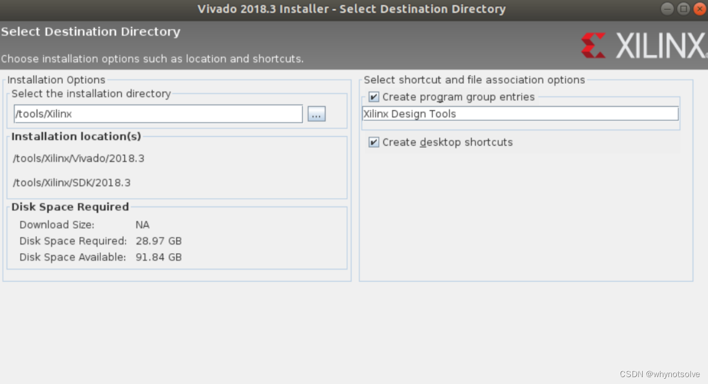
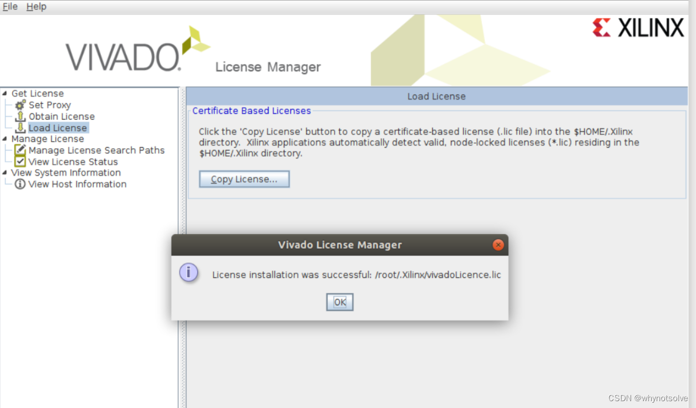
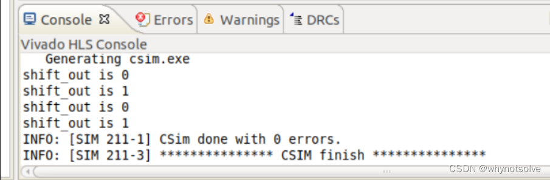

---
第12周作业--HLS入门
-----------------------

### 实验要求；

#### 一. HLS是什么？与VHDL/Verilog编程技术有什么关系?

#### 二. HLS有哪些关键技术问题？目前存在什么技术局限性？

#### 三. 在win10（或者Ubuntu系统下）安装 Intel 或者 Xilinx 的支持HLS的FPGA编程开发软件（Quartus18或者Vivado18），设置好环境，完成一个入门级的HLS程序，并进行仿真或者实际开发板运行。

#### 一. HLS是什么？与VHDL/Verilog编程技术有什么关系?

HLS(High-Level Synthesis)高层综合，就是将 C/C++的功能用 RTL 来实现，将 FPGA 的组件在一个软件环境中来开发，这个模块的功能验证在软件环境中来实现，无缝的将硬件仿真环境集合在一起，使用软件为中心的工具、报告以及优化设计，很容易的在 FPGA 传统的设计工具中生成 IP。  
传统的 FPGA 开发，首先写 HDL 代码，然后做行为仿真，最后做综合、时序分析等，最后生成可执行文件下载到 FPGA 使用，开发周期比较漫长。  
使用 HLS，用高级语言开发可以提高效率。  
因为在软件中调试比硬件快很多，在软件中可以很容易的实现指定的功能，而且做 RTL仿真比软件需要的时间多上千倍。

HLS使用模式verilog 适合于RTL 级别的硬件描述，但是RTL 级别的硬件描述其实还是过于底层，因此这也带来了很多繁重的编码和设计工作，类似于汇编程序一样，合适的解决方案类似于软件编程中从汇编走向C/C++的过程，提供一个更高层次的抽象描述，并提供一些基本的微结构组件，用于快速搭建数字系统。像blue spec/ chisel就给我有这种感觉。

无论是HLS还是Verilog，两者代表了两个"极端"的方向。Verilog可以精准的控制电路实现，但实现起来需要较长的周期，而HLS虽然可快速迭代，但其从软件到硬件翻译无论是面积还是资源均难以控制。

#### 二. HLS有哪些关键技术问题？目前存在什么技术局限性？

###### 字长分析和优化：

    FPGA 的一个最主要特点就是可以使用任意字长的数据通路和运算。因此，FPGA 的 HLS 工具不需要拘泥于某种固定长度（如常见的 32 位或 64 位）的表达方式，而可以对设计进行全局或局部的字长优化，从而达到性能提升和面积缩减的双重效果。

###### 循环优化：

    循环优化一直是 HLS 优化方法的研究重点和热点，因为这是将原本顺序执行的高层软件循环有效映射到并行执行的硬件架构的重点环节。
    一个流行的循环优化方法，就是所谓的多面体模型，即 Polyhedral Model。多面体模型的应用非常广泛，在 HLS 里主要被用来将循环语句以空间多面体表示，然后根据边界约束和依赖关系，通过几何操作进行语句调度，从而实现循环的变换。需要指出的是，多面体模型在 FPGA HLS 里已经取得了相当的成功，很多研究均证明多面体模型可以帮助实现性能和面积的优化，同时也能帮助提升 FPGA 片上内存的使用效率。

###### 对软件并行性的支持：

    C/C++与 RTL 相比，一个主要的区别是，前者编写的程序被设计用来在处理器上顺序执行，而后者可以通过直接例化多个运算单元，实现任务的并行处理。
    随着处理器对并行性的逐步支持，以及如 GPU 等非处理器芯片的兴起，C/C++ 开始逐渐引入对并行性的支持。例如，出现了 pthreads 和 OpenMP 等多线程并行编程方法，以及 OpenCL 等针对 GPU 等异构系统进行并行编程的 C 语言扩展。
    因此作为 HLS 工具，势必要增加对这些软件并行性的支持。例如，LegUp 就整合了度 pthreads 和 OpenMP 的支持，从而可以实现任务和数据层面的并行性。

1.HLS编译器问题  
HLS编译器是静态工具，对理解代码的动态特性没有任何帮助。==HLS编译器的行为通常难以预测最终的性能和资源利用率。==因此，设计人员必须通过对相应的代码部分应用各种编译指示及其相关的参数设置，来手动探索设计空间，直到达到设计目标。  
2.对于一些简单的逻辑，HLS实现结果较为臃肿。  
一些简单的逻辑，用HDL实现只需要数十行代码，而HLS的实现结果却相当复杂。  
3.HLS对开发人员的要求比较高。  
HLS使用的语言显然不是标准C/C++语言，应该是扩展类C/C++语言。例如可以使用int1、int7等类型定义位宽为1、7的变量。HLS开发对从业人员的要求还是比较高的，需要软硬兼通才比较好。字长分析和优化需要 HLS 的使用者对待综合的算法和数据集有深入的了解，这也是限制这种优化方式广泛使用的主要因素之一。

HLS 工具的结果质量（QoR）往往落后于手动寄存器传输级别（RTL）流程的质量。  
在性能和执行时间上，HLS 设计的平均水平明显较差，但在延迟和最大频率方面，与 RTL 差异不那么明显，且 HLS 方法还会浪费基本资源，平均而言，HLS 使用的基本 FPGA 资源比 RTL 多 41%，在以千位为单位的 BRAM 使用情况的论文中，RTL 更胜一筹。

#### 三. 在win10（或者Ubuntu系统下）安装 Intel 或者 Xilinx 的支持HLS的FPGA编程开发软件（Quartus18或者Vivado18），设置好环境，完成一个入门级的HLS程序，并进行仿真或者实际开发板运行。

#### {#31vivado_63}3.1安装vivado：

将安装文件放到Ubuntu中，解压

    sudo tar xvzf /mnt/hgfs/ubuntshare/Vivado_SDK_2018.3_1207_2324.tar.gz

进入解压文件夹中，运行安装文件

    sudo ./xsetup

正常下载，接受条款，并勾选使用到的工具后：

安装成功后将license放到文件中

**权限：**

    sudo chmod -R 777 /tools/Xilinx 
    sudo chmod -R 777 ~/.Xilinx/

**下载驱动：**

    cd /tools/Xilinx/Vivado/2018.3/data/xicom
    /cable_drivers/lin64/install_script/install_drivers
    sudo ./install_drivers 

**环境变量配置：**

    sudo gedit .bashrc

**打开.bashrc后写入：**

    source /tools/Xilinx/Vivado/2018.3/settings64.sh

#### LED实验：

首先启动Vivado hls

    source /tools/Xilinx/Vivado/2018.3/settings64.sh
    vivado_hls

创建空白项目并根据需要选择器件：

    //新建led.cpp，写入代码
    #include "led.h"
    void flash_led(led_t *led_o , led_t led_i){
    	#pragma HLS INTERFACE ap_vld port=led_i
    	#pragma HLS INTERFACE ap_ovld port=led_o
    	cnt_t i;
    	for(i=0;i<CNT_MAX;i++)
    	{
    		if(i==FLASH_FLAG)
    		{
    			*led_o = ~led_i;
    		}
    	}
    }

    //新建led.h，写入代码
    #ifndef _SHIFT_LED_H_
    #define _SHIFT_LED_H_

    #include "ap_int.h"

    #define CNT_MAX 100000000
    //#define CNT_MAX 100

    #define FLASH_FLAG CNT_MAX-2
    // typedef int led_t;
    // typedef int cnt_t;

    typedef ap_int<1> led_t;
    typedef ap_int<32> cnt_t;
    void flash_led(led_t *led_o , led_t led_i);

    #endif

最后添加C仿真文件，test Bench新建文件，写入代码：

    #include "led.h"
    void flash_led(led_t *led_o , led_t led_i){
    	cnt_t i;
    	for(i=0;i<CNT_MAX;i++)
    	{
    		if(i==FLASH_FLAG)
    		{
    			*led_o = ~led_i;
    		}
    	}
    }

进行仿真：

